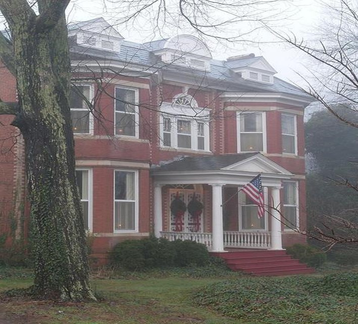
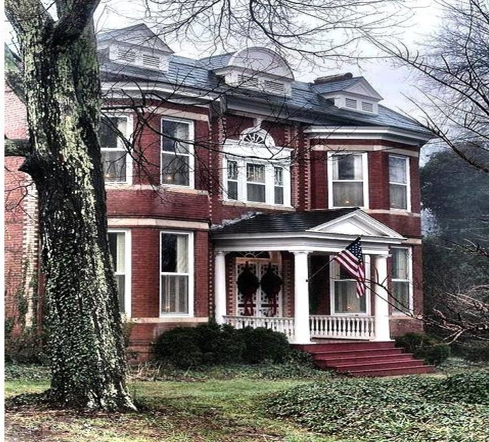
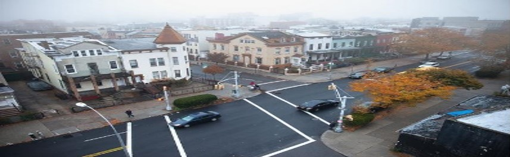
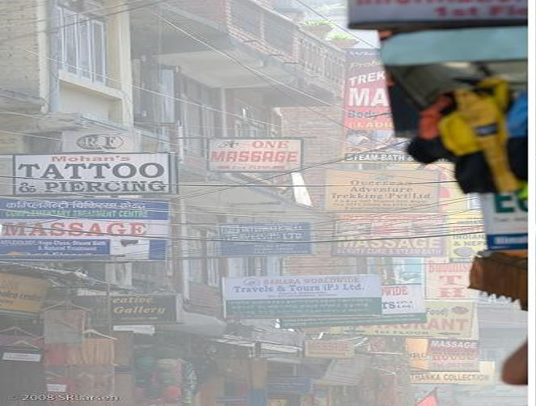
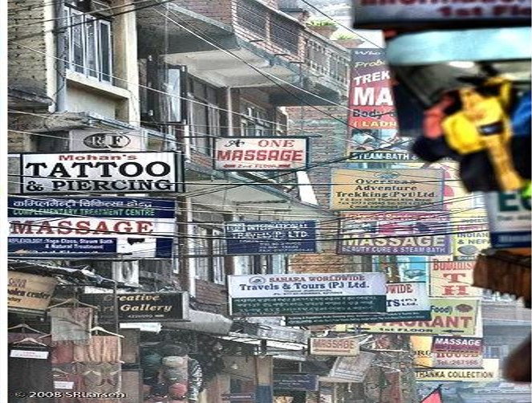
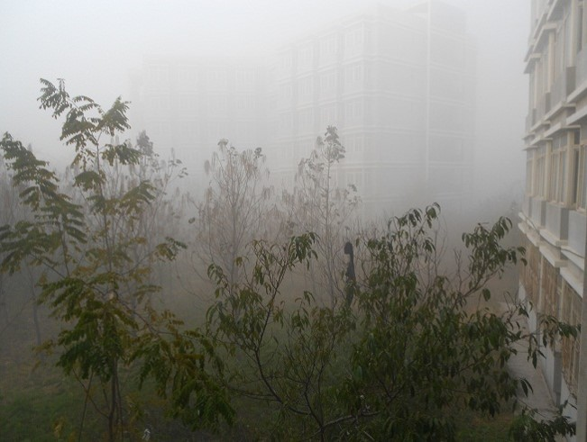
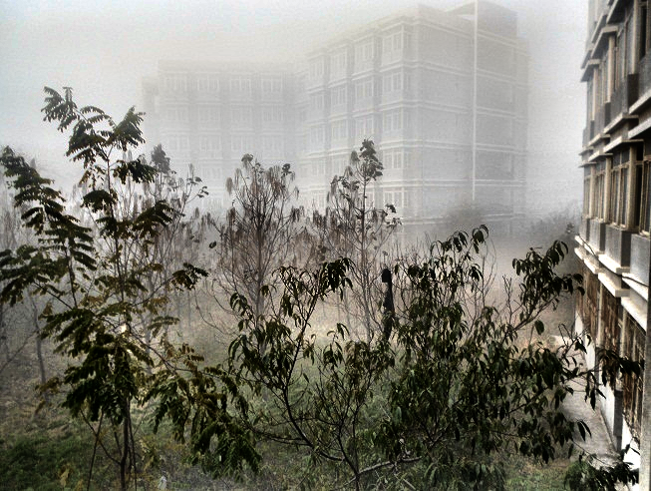

# RADE：Fast Region-Adaptive Defogging and Enhancement

MATLAB code for our ICPR 2020 paper "Z. Li, X. Zheng, B. Bhanu, S. Long, Q. Zhang, Z. Huang. Fast Region-Adaptive Defogging and Enhancement for Outdoor Images Containing Sky."  
It is used for image dehazing / image defogging / image enhancement for images of outdoor scenes sepecially containing sky.

## Run
````
example:
   HazyIn = imread('3.jpg'); 
   DehazeOut = RADE(HazyIn,5,0.8,0.03);
````
Authorized by Zhan Li (lizhan@jnu.edu.cn) created on Feb 23th, 2020 and released on Dec. 9th, 2020.

## Requirement
The code was tested on MATLAB (R2015a), 64-bit Win10.  

## Citing 

The code is free for academic/research purpose. Please kindly cite our work in your publications if it helps your research.  

```BibTeX
@article{
  title={Fast Region-Adaptive Defogging and Enhancement for Outdoor Images Containing Sky},
  author={Z. Li, X. Zheng, B. Bhanu, S. Long, Q. Zhang, Z. Huang},
  conference={The 25th International Conference on Pattern Recognition (ICPR). IEEE, Milan, Italy. 2021, 10th-15th Jan},
  year={2020}
}
```
## Example
**Comparison**

<div align=center>
<center class="half">
    </center></div>

<div align=center>
<center class="half">
    </center></div>
    
<div align=center>
<center class="half">
    </center></div>
    
<div align=center>
<center class="half">
    </center></div>
    

[](https://badges.toozhao.com/stats/01F0MPA6GQQXGBJSVKT85C4PKT "Get your own page views count badge on badges.toozhao.com")
